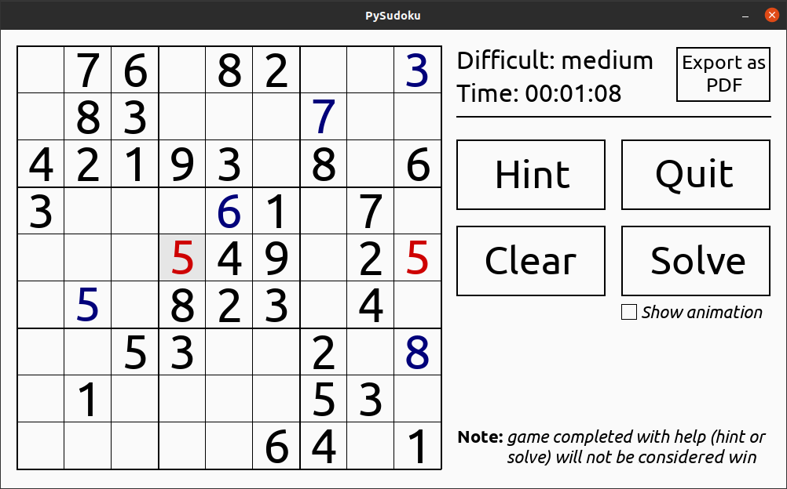
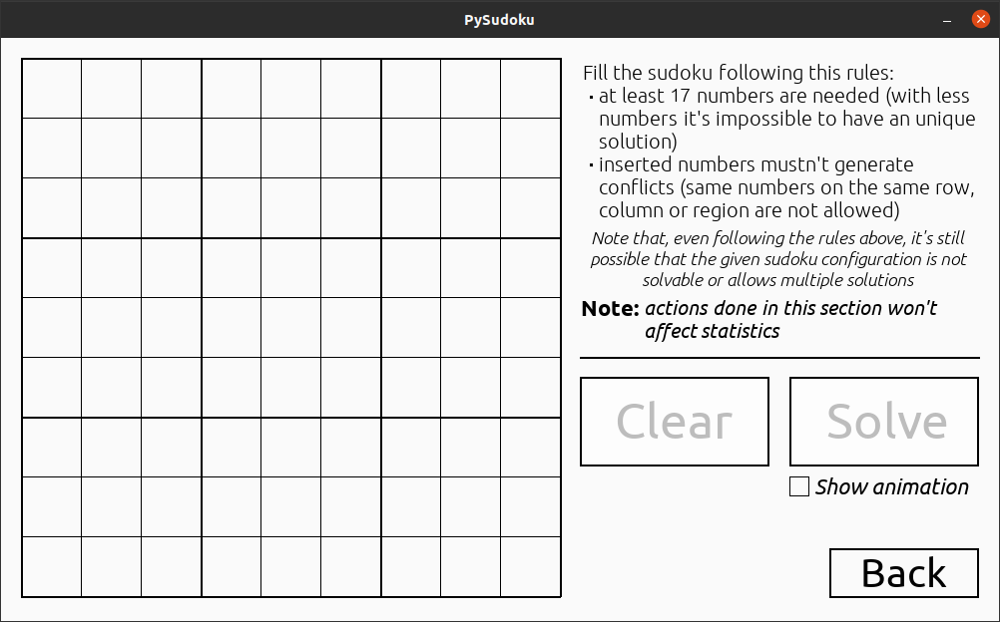

# PySudoku

## Table of content

* [Introduction](#Introduction "Go to the section")
* [Setup](#Setup "Go to the section")
* [How to play](#How-to-play "Go to the section")
* [License](#License "Go to the section")

## Introduction

Born as simple solving algorithm for sudoku, this project has evolved into a more complex game to play sudoku.</br>
The main purposes of this application are both to give a good playing experience, while showing the player how backtracking algorithms works through visual animations.


## Setup

This program has been written and tested in <b><i> Python 3.8.5</i></b>.</br>
To run this program the following modules are required:

<ul>
    <li><b>Pygame</b> (version: <i>2.0.1</i>);</li>
    <li><b>Reportlab</b> (version: <i>3.5.34</i>).</li>
</ul>

If not already present on the system, they can be installed individually (<u><i>is strongly suggested to install the exact verison specified for each module</i></u>) or by following the instructions below:

1. Open the terminal in the folder <b><i>PySudoku</i></b>;

2. Type the following command in the terminal:

    ```console
    pip3 install -r requirements.txt
    ```

Because all other modules used are part of the <i> Python Standard Library</i> they are already included in Python and don't need to be installed.</br>

Once all the requirements above are satisfied, it's possible to execute the <b><i>main.py</i></b> file. To do that open the terminal and type the following command:

```console
python main.py
```

## How to play

### Play



In <i>Play</i> mode, after selecting a difficult level between <i>easy</i>, <i>medium</i> and <i>hard</i>, the user can play a game.</br>

<b>NOTE: </b><i>The difficult level are based on the number of "free space" on the sudoku board.</i></br>

The <i>difficult level</i> and the <i>game time</i> are showed on the top right of the screen.</br>
In this mode is possible to export the sudoku on screen in PDF format.</br>

<b>NOTE: </b><i>The export function will generate a sudoku containing only fixed numbers (the "black" numbers on the grboardid), so every number given by the user (the "blue" numbers) during the game will not be included in the generated PDF file.</i></br>

The following features are available:

<ul>
    <li><b>Hint: </b>This feature will add the number expected "as solution" in the selected cell. Can be used only when a cell is selected;</li>
    <b>IMPORTANT: </b><i>As indicated in the game itself, using this option will invalidate the eventual win and the difficult will be changed as "-" (undefined).</i>
    <li><b>Quit: </b>Quit the actual game and come back to the main menù;</li>
    <li><b>Clear: </b>Remove all the given ("blue") number on the board;</li>
    <li><b>Solve: </b>Solve the sudoku board. This feature can be executed with or without showing the animation by using the checkbox under the Solve button.</li>
</ul>

### Solve



In <i>Solve</i> mode the palyer can make a custom sudoku board and let the algorithm solve it.</br>

As said before, one of the purpouse of this project is to give a visual explaination of how the program "thinks". This mode exist exactly for this! The player can use the white board to create his own sudoku or to solve an existing one.</br> 

In this mode two different features can be performed:

<ul>
    <li><b>Clear: </b>Remove all numbers form the board;</li>
    <li><b>Solve: </b>As in play mode this feature can be executed with or without showing the animation.</li>
</ul>

<b>NOTE: </b><i>All the operations performed in this section won't influence game statistics (see Stats section to know more about).</i>

### Stats

In </i>Stats</i> section are showed all the datat collected during the game and selected by difficult level.</br>
This section is divided in two main area:

<ul>
    <li><b>Player stats: </b>Show player statistics;</li>
    <li><b>Algorithm stats: </b>Show algorithm statistics.</li>
</ul>

While player stats are generated by collecting data during game in Play mode, algorithm stats are collected by keeping track of algorithm performance during both <i>generation</i> and <i>solving</i> phase. This help the user to understand how the algorithm work in different scenarios (tipically a sudoku with a lot of given numbers take less time to generate and solve compared to a sudoku with less given numbers).

## License 

[MIT License](LICENSE) - <i> Copyright (c) 2021 </i>
